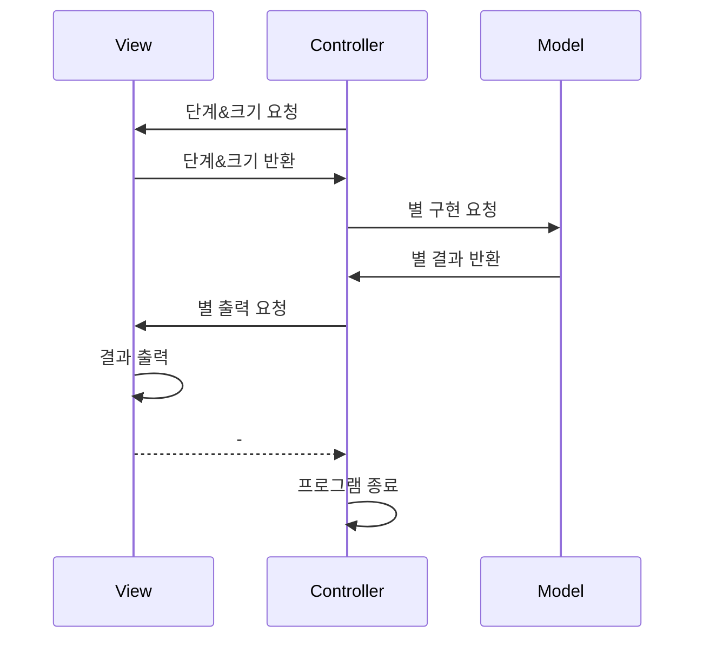

# All-rounder Backend Study

## 1주차 미션 - 별찍기

### 구현 기능 목록

- 입출력
    - 단계 입력
    - 크기 입력
    - 결과 출력
- 별찍기
    - 단계별 별찍기 (1~9)
        - 7단계 : 빈 사각형 모양을 재귀적으로 호출해서 구현
        - 8단계 : 순차적으로 삼각형을 만들며 병합(덧씌움)
        - 9단계 : 대칭성을 이용하여 V자를 구현한 후 반전

### 세부 로직

- 뷰에서 입력을 받고, 입력에 맞는 별을 요청한다.
- `starPrinter` 인터페이스를 확장한 구현체에서 별을 구현한 후, `List<StringBuilder>` 형태로 반환한다.
- 결과를 뷰에서 출력한다.

### Flow Chart

